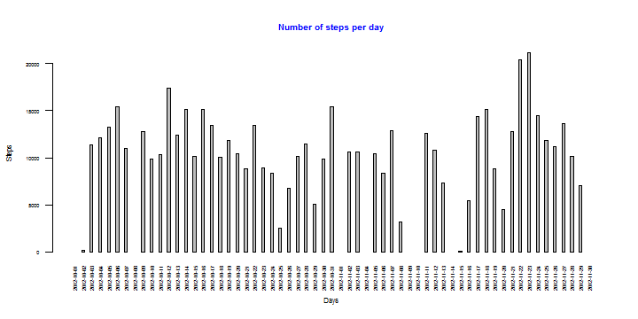
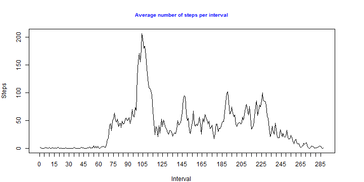
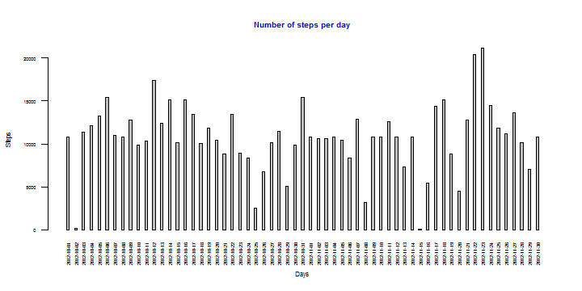
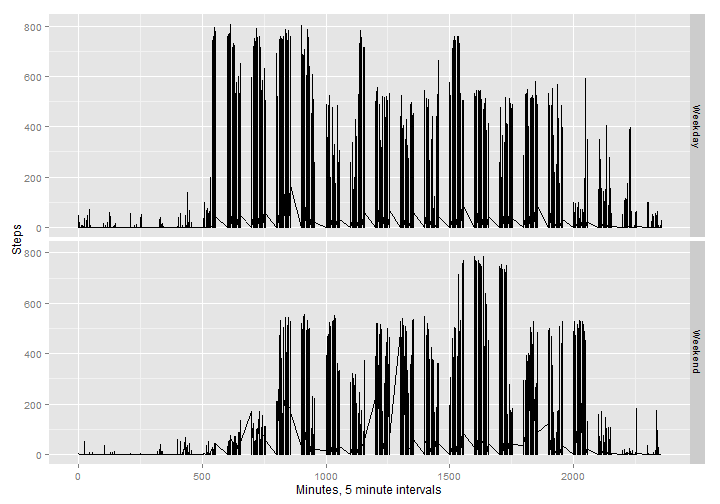

"Reproducable Research" assignment 1
====================================


This is knitr file with my Assignment 1.

In this assignment I am going to work data from a personal activity monitoring device. This device collects data at 5 minute intervals through out the day. The data consists of two months of data from an anonymous individual collected during the months of October and November, 2012 and include the number of steps taken in 5 minute intervals each day.


I am going to 
- load data 
- look at mean values for number of steps
- check for daily acitivity pattern
- replace missing values with an approximate value
- check how NA replacement afftected my data

#### Load data

First, I load the data from activity.csv file,located in the same folder wiith this script


```r
DailySteps <- read.csv("activity.csv", na.strings = "NA")
```

#### Mean values investigation
I will use dplyr package to check mean summaries


First, I create dataframe StepsSummary, which contains total number of steps per day


```r
StepsSummary <- DailySteps %>%
    group_by(date) %>%
    summarise(sum(steps)) %>%
    as.data.frame()
names(StepsSummary)<-c("date","TotalNumberSteps")
```

This plot shows number of steps, taken each day.


```r
barplot(StepsSummary$TotalNumberSteps, 
         space=2, 
         xlab="Days", ylab = "Steps", 
         cex.axis=.5, cex.names=.5, cex.lab=0.7, 
         las=2, 
         names.arg=StepsSummary$date, 
         main="Number of steps per day", cex.main=0.8, col.main="blue")
```

 

Mean for steps, taken per day, is 

```r
mean(StepsSummary$TotalNumberSteps,na.rm=TRUE)
```

```
## [1] 10766.19
```


Median for steps, taken per day, is 

```r
median(StepsSummary$TotalNumberSteps,na.rm=TRUE)
```

```
## [1] 10765
```
I remove StepsSummary dataframe in order to free memory

```r
rm(StepsSummary)
```

####Average daily activity pattern

First, I create dataframe DailyAct, which contains summary of steps per interval


```r
DailyAct<-DailySteps %>%
group_by(interval) %>%
summarise(mean(steps, na.rm=TRUE)) %>%
as.data.frame()
names(DailyAct)<-c("interval","AvSteps")
intnums<-c(1:nrow(DailyAct))
DailyAct[,"intnum"] <- intnums
```

Following plot shows average number of steps, taken each interval.


```r
par(mar=c(4,4,4,4))

plot(DailyAct$AvSteps, xaxt="n", 
      type="l",  
      xlab="Interval", ylab = "Steps",  
      main="Average number of steps per interval", cex.main=0.8, col.main="blue")
 
 axis(1, xlim=c(0, nrow(DailyAct)), at=seq(0,nrow(DailyAct),by=5))
```

 
Maximum number of steps 

```r
max(DailyAct$AvSteps) 
```

```
## [1] 206.1698
```

is in interval #

```r
DailyAct$intnum[DailyAct$AvSteps==max(DailyAct$AvSteps)]
```

```
## [1] 104
```


####Imputing missing values

In this section I am going to replace missing numbers of steps with mean values for corresponding intervals and see, how it changes values of total steps per day, mean and median of these values.

#####Check amount of rows with missing data

First,lets see how many rows with missing data there is in data set:


```r
nrow(DailySteps)-nrow(na.omit(DailySteps))
```

```
## [1] 2304
```

Lets have a look at how many rows missing number of steps.


```r
nrow(DailySteps[is.na(DailySteps$steps)==TRUE,])
```

```
## [1] 2304
```
#####Fill in the missing data

My strategy is to  fill these NA values with mean values for corresponding 5-minute intervals.

To achieve this, I will:

- Separate rows with missing data from full rows 

- Merge dataframe with missing data with the dataframe, containing mean values for an interval. Merge will be done on "interval" field, so in each row there is a value for the interval

- Remove duplicates, so I have one row for each combination of each data and interval

- Rename columns

- Unite the dataframe with original date with the dataframe, containing estimated data


```r
#steps with NA values
NADailySteps <- DailySteps[is.na(DailySteps$steps)==TRUE,]
#Dataframe with known steps number
FullDailySteps <- DailySteps[is.na(DailySteps$steps)==FALSE,]
meansteps <- merge(DailyAct, NADailySteps, by="interval")
meansteps <- meansteps[!duplicated(meansteps[,c('interval','date')]),]
meansteps<-meansteps[,c('AvSteps', 'date', 'interval')]
colnames(meansteps)<-c('steps', 'date', 'interval')
FullDailySteps <- rbind(FullDailySteps, meansteps)
#Free up some RAM
rm(meansteps)
rm(NADailySteps)
```
#####Compare data with estimation with data with NAs

Data transformation and call to draw a histogram of the total number of steps taken each day are same, as in the first section of this doucment.
The only difference is that I use FullDailySteps with replaced NA values.


```r
StepsSummary <- FullDailySteps %>%
    group_by(date) %>%
    summarise(sum(steps)) %>%
    as.data.frame()
names(StepsSummary)<-c("date","TotalNumberSteps")
```
There are no more missing bars in the plot with replaced NA's:


```r
barplot(StepsSummary$TotalNumberSteps, 
         space=2, 
         xlab="Days", ylab = "Steps", 
         cex.axis=.5, cex.names=.5, cex.lab=0.7, 
         las=2, 
         names.arg=StepsSummary$date, 
         main="Total number of steps per day", cex.main=0.8, col.main="blue")
```

 

Mean for steps, taken per day, did not change significantly, and equals: 

```r
mean(StepsSummary$TotalNumberSteps,na.rm=TRUE)
```

```
## [1] 10766.19
```


Median for steps, taken per day, increased by 1 step: 

```r
median(StepsSummary$TotalNumberSteps,na.rm=TRUE)
```

```
## [1] 10766.19
```

As a conclusion, replacing missing values with mean values provided data for the days, for which data was not available at all.
It did not change mean and median values significantly.

####differences in activity patterns between weekdays and weekends

In the final part of research I am going to look for differences in moves on week and the weekends.

The following code adds column "weekd"" to dataframe FullDailySteps.
"weekd" can have 2 values, "weekday" or "weekend"

```r
Sys.setlocale("LC_TIME", "English")
```

```
## [1] "English_United States.1252"
```

```r
FullDailySteps <- mutate(FullDailySteps, weekd=weekdays(strptime(date, "%Y-%m-%d")))
FullDailySteps <- mutate(FullDailySteps, weekd=ifelse(weekd %in% c('Saturday','Sunday'), 'Weekend', 'Weekday'))
FullDailySteps <- mutate(FullDailySteps, weekd=factor(weekd, levels=c('Weekday', 'Weekend')))
```

This plot shows daily activity between on weekdays and weekends.
It shows, that more activity is started early in the day on weekdays.
On weekends, the subject of observation starts walking actively later.


```r
library(ggplot2)
qplot(interval, steps, data=FullDailySteps, geom="line", xlab="Minutes, 5 minute intervals", ylab="Steps", facets=weekd ~.)
```

 

